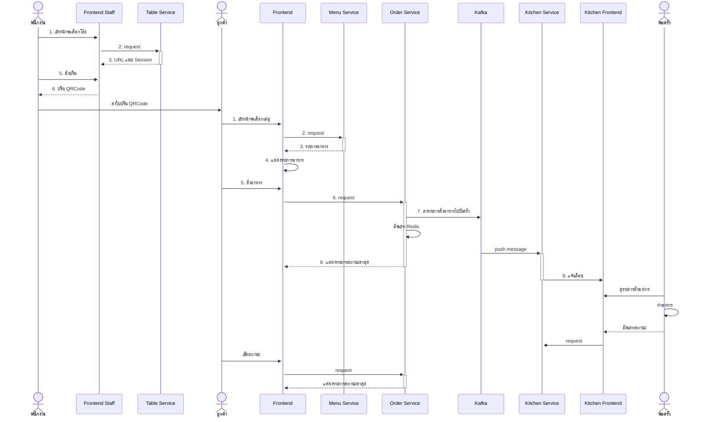

# Project Overview

# Mini Food Story – ระบบสั่งอาหารภายในร้าน

**mini food story** เป็นระบบจัดการร้านอาหารแบบนั่งทานในร้าน (Dine-in) ที่ออกแบบโดยใช้สถาปัตยกรรมแบบ Microservice  
รองรับการสั่งอาหารผ่านการสแกน QR บนโต๊ะ, การแสดงรายการอาหารในครัวแบบ Real-time และระบบบันทึกการชำระเงินอย่างครบวงจร

ระบบพัฒนาด้วยภาษา Go (Golang) โดยใช้ Redis, PostgreSQL, Kafka และ WebSocket ในการจัดการข้อมูลและส่งต่อ event แบบทันที

เพื่อเพิ่มประสิทธิภาพและความสามารถในการตรวจสอบระบบ **[Prometheus](https://prometheus.io)** และ **[Grafana](https://grafana.com)** ถูกนำมาใช้ร่วมกันกับ **[API Gateway Traefik](https://github.com/traefik/traefik)** ในการตรวจสอบการทำงานของระบบและวิเคราะห์ปัญหาแบบเรียลไทม์:

---

## 🧱 องค์ประกอบหลักของระบบ

โปรเจคนี้มีโครงสร้างแบบ Mono Repository ดังนี้:

- **Table Service** – จัดการสถานะของโต๊ะ และสร้าง session เมื่อลูกค้าสแกน QR
- **Menu Service** – จัดการข้อมูลเมนูอาหาร หมวดหมู่ และสถานะการขาย
- **Order Service** – บันทึกรายการสั่งอาหาร และเปลี่ยนสถานะของแต่ละจาน
- **Kitchen Service** – รับข้อมูลจาก Kafka แล้วแสดงรายการอาหารที่ต้องปรุงในครัวแบบ Real-time
- **Payment Service** – จัดการข้อมูลการชำระเงิน และเปลี่ยนสถานะคำสั่งซื้อให้เสร็จสมบูรณ์

ระบบใช้ **Kafka** ในการสื่อสารระหว่าง Service และใช้ **WebSocket** สำหรับการแจ้งเตือนแบบเรียลไทม์ในหน้าครัว

---

## 🚀 คุณสมบัติเด่น

- ระบบจัดการโต๊ะด้วย QR Code
- สร้าง session สำหรับแต่ละโต๊ะใน Redis
- แจ้งรายการอาหารใหม่ไปที่ครัวทันทีผ่าน Kafka และ Websocket
- ครัวสามารถอัปเดตสถานะอาหาร เช่น “เสริฟแล้ว”, “ยกเลิก”
- ระบบบันทึกการชำระเงิน พร้อมเชื่อมโยงกับออเดอร์
- ใช้ Clean Architecture เพื่อความง่ายในการดูแลรักษาโค้ด
- ใช้ **Keycloak** สำหรับ Authentication และ Authorization ที่ปลอดภัย
- รวม **Prometheus** และ **Grafana** เพื่อ Monitoring และสร้าง Dashboard
   - ตรวจสอบ Metrics เช่น Request Rate, Latency, และ Error Rate
- ใช้ **Traefik** เป็น API Gateway สำหรับจัดการ Traffic
- รองรับการวิเคราะห์การทำงานแบบ Real-time ผ่านการเก็บ Logs และ Metrics

---

## 🛠️ เทคโนโลยีที่ใช้

- Golang
- PostgreSQL
- Redis
- Apache Kafka
- WebSocket (Fiber)
- Docker Compose
- Keycloak
- Grafana Dashboard
- Prometheus

---

## 📝 เอกสารอื่น ๆ
[Postman Collection](https://raw.githubusercontent.com/p-jirayusakul/mini-food-sotry/refs/heads/main/postman_collection.json)

**swagger url**:
- **Table Service** – https://api.phatthakarn.me/api/v1/tables/swagger/index.html
- **Menu Service** – https://api.phatthakarn.me/api/v1/menu/swagger/index.html
- **Order Service** – https://api.phatthakarn.me/api/v1/orders/swagger/index.html
- **Kitchen Service** – https://api.phatthakarn.me/api/v1/kitchen/swagger/index.htmle
- **Payment Service** – https://api.phatthakarn.me/api/v1/payments/swagger/index.html

**Traefik Dashboard**:
[https://traefik.phatthakarn.me/dashboard/#/](https://traefik.phatthakarn.me/dashboard/#/)


**Grafana Dashboard**:
[https://grafana.phatthakarn.me](https://grafana.phatthakarn.me)


--- 
## 🏗️ โครงสร้างโปรเจคและสถาปัตยกรรม

ระบบนี้พัฒนาโดยใช้แนวทาง **Mono Repository** และออกแบบโดยใช้ **Clean Architecture** เพื่อให้การพัฒนามีประสิทธิภาพและสามารถจัดการโค้ดได้ง่ายในระยะยาว:

### Mono Repository
**Mono Repository** เป็นเทคนิคที่รวมโค้ดทั้งหมดของบริการ (Services) ไว้ในที่เก็บโค้ดเดียวกัน (Git repository เดียว) ซึ่งมีข้อดีดังนี้:
- การจัดการเวอร์ชันระหว่างบริการทำได้ง่าย เนื่องจากทุกบริการอยู่ใน repository เดียว
- การแชร์โค้ดหรือ dependency ร่วมกัน (ผ่านโฟลเดอร์ `shared` หรือ `pkg`) ทำได้โดยง่าย
- การตั้งค่า CI/CD เดียวสามารถควบคุมการพัฒนาระบบทั้งหมดในที่เดียว

### ยกตัวอย่างโครงสร้างใน Clean Architecture:
ใน `menu-service/internal` จะแบ่งเป็นโฟลเดอร์ย่อย เช่น:
- `domain`: เก็บ model ของหมวดหมู่และเมนูอาหาร (e.g. `categories.go`, `product.go`)
- `adapter`: การเชื่อมต่อกับ repository, caching, และระบบ HTTP
- `usecase`: โลจิกสำหรับการประมวลผล Use Case (e.g. การดึงรายการอาหาร หรือการค้นหาเมนู)
- `server.go`: เป็นจุดเริ่มต้นของแอปพลิเคชัน ใช้ configure middleware, health check และเชื่อมโยงชั้นต่าง ๆ เข้าด้วยกัน

---

## การติดตั้งและเริ่มต้นใช้งาน
1. **Clone Repository**
   ```bash
   git clone https://github.com/p-jirayusakul/mini-food-sotry.git
   cd mini-food-sotry
   ```

2. **ตั้งค่าตัวแปรสภาพแวดล้อม**
   ตรวจสอบไฟล์ `.env` และตั้งค่าตามที่ต้องการ

3. **รันด้วย Docker Compose**
   หากคุณมี Docker และ Docker Compose ติดตั้งอยู่ ให้รันคำสั่งดังนี้:
    ```bash
   docker compose build
   ```
   ```bash
   docker compose up
   ```

## 👥 ผู้ใช้งานระบบ Keycloak

| Username  | Password | Role    |
|-----------|----------|---------|
| waiter01  | 123456   | waiter  |
| cashier01 | 123456   | cashier |
| chef01    | 123456   | Kitchen |

**Curl สำหรับ login**
   ```bash
   curl --location 'https://auth.phatthakarn.me/realms/foodstory/protocol/openid-connect/token' \
   --header 'Content-Type: application/x-www-form-urlencoded' \
   --data-urlencode 'grant_type=password' \
   --data-urlencode 'client_id=payment-service' \
   --data-urlencode 'client_secret=WCh6gtmy4pZdNWsB4LQQ6TJFcdX7MZf8' \
   --data-urlencode 'username=cashier01' \
   --data-urlencode 'password=123456'
   ```