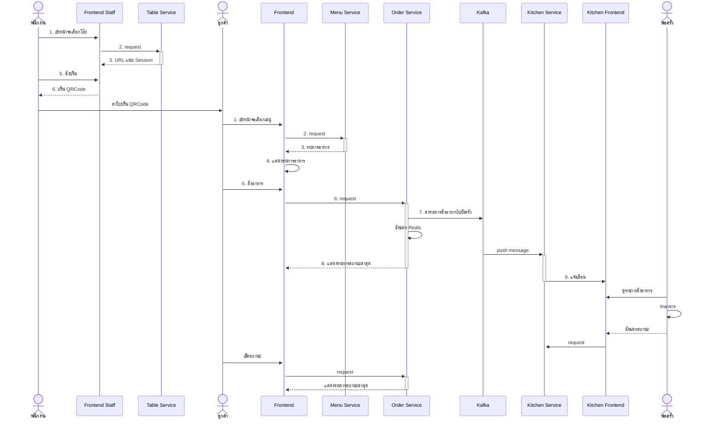

# Project Overview

# FoodStory – ระบบสั่งอาหารภายในร้าน

**FoodStory** เป็นระบบจัดการร้านอาหารแบบนั่งทานในร้าน (Dine-in) ที่ออกแบบโดยใช้สถาปัตยกรรมแบบ Microservice  
รองรับการสั่งอาหารผ่านการสแกน QR บนโต๊ะ, การแสดงรายการอาหารในครัวแบบ Real-time และระบบบันทึกการชำระเงินอย่างครบวงจร

ระบบพัฒนาด้วยภาษา Go (Golang) โดยใช้ Redis, PostgreSQL, Kafka และ WebSocket ในการจัดการข้อมูลและส่งต่อเหตุการณ์แบบทันที

---

## 🧱 องค์ประกอบหลักของระบบ

ระบบนี้ถูกแบ่งออกเป็น 5 บริการหลัก:

- **Table Service** – จัดการสถานะของโต๊ะ และสร้าง session เมื่อลูกค้าสแกน QR
- **Menu Service** – จัดการข้อมูลเมนูอาหาร หมวดหมู่ และสถานะการขาย
- **Order Service** – บันทึกรายการสั่งอาหาร และเปลี่ยนสถานะของแต่ละจาน
- **Kitchen Service** – รับข้อมูลจาก Kafka แล้วแสดงรายการอาหารที่ต้องปรุงในครัวแบบ Real-time
- **Payment Service** – จัดการข้อมูลการชำระเงิน และเปลี่ยนสถานะคำสั่งซื้อให้เสร็จสมบูรณ์

ระบบใช้ **Kafka** ในการสื่อสารระหว่าง Service และใช้ **WebSocket** สำหรับการแจ้งเตือนแบบเรียลไทม์ในหน้าครัว

---

## 🚀 คุณสมบัติเด่น

- ระบบจัดการโต๊ะด้วย QR Code
- สร้าง session สำหรับแต่ละโต๊ะใน Redis
- แจ้งรายการอาหารใหม่ไปที่ครัวทันทีผ่าน Kafka และ Websocket
- ครัวสามารถอัปเดตสถานะอาหาร เช่น “เสริฟแล้ว”, “ยกเลิก”
- ระบบบันทึกการชำระเงิน พร้อมเชื่อมโยงกับออเดอร์
- ใช้ Clean Architecture เพื่อความง่ายในการดูแลรักษาโค้ด

---

## 🛠️ เทคโนโลยีที่ใช้

- Golang
- PostgreSQL
- Redis
- Apache Kafka
- WebSocket (Fiber)
- Docker Compose

---

## การติดตั้งและเริ่มต้นใช้งาน
1. **Clone Repository**
   ```bash
   git clone https://github.com/p-jirayusakul/mini-food-sotry.git
   cd mini-food-sotry
   ```

2. **ตั้งค่าตัวแปรสภาพแวดล้อม**
   ตรวจสอบไฟล์ `.env` และตั้งค่าตามที่ต้องการ

3. **รันด้วย Docker Compose**
   หากคุณมี Docker และ Docker Compose ติดตั้งอยู่ ให้รันคำสั่งดังนี้:
    ```bash
   docker compose build
   ```
   ```bash
   docker compose up
   ```
   
4. **การรันคำสั่งอื่นๆ**
   ใช้ `Makefile` สำหรับการรันคำสั่งพิเศษ เช่น การสร้างหรือทดสอบ
    
   ###### generate sql with sqlc
   ```bash
   make sqlc
   ```
   ###### generate mockup for unit test
   ```bash
   make mock
   ```

## การพัฒนาและการมีส่วนร่วม
1. **Branching Model**
   - ใช้ `main` สำหรับ version ที่สามารถใช้งานได้
   - ใช้ branch feature เช่น `feature/<ชื่อฟีเจอร์>` สำหรับการพัฒนา

2. **เปิด Pull Request**
   - ตรวจสอบว่าฟีเจอร์ครบถ้วนและผ่านการทดสอบก่อนเปิด PR
   - เพิ่มคำอธิบายให้ชัดเจนถึงการเปลี่ยนแปลงที่ทำ

> **หมายเหตุ**: หากมีบริการที่จะเพิ่มในอนาคต คุณสามารถขยายโฟลเดอร์ในโครงสร้างโปรเจคตามความเหมาะสม