# Project Overview

```mermaid
sequenceDiagram
   actor Staff as พนักงาน
   participant FrontendStaff as Frontend Staff
   participant TableService as Table Service
   actor User as ลูกค้า
   participant Frontend as Frontend
   participant MenuService as Menu Service
   participant OrderService as Order Service
   participant Kafka as Kafka
   participant KitchenService as Kitchen Service
   participant KitchenFrontend as Kitchen Frontend
   actor Cook as พ่อครัว

   Staff->>+FrontendStaff: 1. เข้าหน้าจอเลือกโต๊ะ
   FrontendStaff ->>+ TableService: 2. request
   TableService -->>- FrontendStaff: 3. URL แนบ Session
   Staff ->> FrontendStaff: 5. สั่งปริ้น
   FrontendStaff -->> Staff: 6. ปริ้น QRCode
   Staff ->> User: ส่งใบปริ้น QRCode


   User->>+Frontend: 1. เข้าหน้าจอเลือกเมนู
   Frontend ->>+ MenuService: 2. request
   MenuService -->>- Frontend: 3. รายการอาหาร
   Frontend->>Frontend: 4. แสดงรายการอาหาร
   User ->> Frontend: 5. สั่งอาหาร
   Frontend ->>+ OrderService: 6. request
   OrderService ->> Kafka: 7. ส่งรายการสั่งอาหารไปยังครัว
   OrderService ->> OrderService: อัพเดท Redis
   Kafka ->>+ KitchenService: push message
   OrderService -->>- Frontend: 8. แสดงรายการสถานะล่าสุด
   KitchenService ->>- KitchenFrontend: 9. แจ้งเตือน
   Cook ->> KitchenFrontend: ดูรายการสั่งอาหาร
   Cook ->> Cook: ทำอาหาร
   Cook -->> KitchenFrontend: อัพเดทสถานะ

   KitchenFrontend ->>+ KitchenService: request
   User ->> Frontend: เช็คสถานะ

   Frontend ->>+ OrderService: request
   OrderService -->>- Frontend: แสดงรายการสถานะล่าสุด

```

# Mini Food Story – ระบบสั่งอาหารภายในร้าน

**mini food story** เป็นระบบจัดการร้านอาหารแบบนั่งทานในร้าน (Dine-in) ที่ออกแบบโดยใช้สถาปัตยกรรมแบบ Microservice  
รองรับการสั่งอาหารผ่านการสแกน QR บนโต๊ะ, การแสดงรายการอาหารในครัวแบบ Real-time และระบบบันทึกการชำระเงินอย่างครบวงจร

ระบบพัฒนาด้วยภาษา Go (Golang) โดยใช้ Redis, PostgreSQL, Kafka และ WebSocket ในการจัดการข้อมูลและส่งต่อ event แบบทันที

เพื่อเพิ่มประสิทธิภาพและความสามารถในการตรวจสอบระบบ **[Prometheus](https://prometheus.io)** และ **[Grafana](https://grafana.com)** ถูกนำมาใช้ร่วมกันกับ **[API Gateway Traefik](https://github.com/traefik/traefik)** ในการตรวจสอบการทำงานของระบบและวิเคราะห์ปัญหาแบบเรียลไทม์:

---

## 🧱 องค์ประกอบหลักของระบบ

โปรเจคนี้มีโครงสร้างแบบ Mono Repository ดังนี้:

- **Table Service** – จัดการสถานะของโต๊ะ และสร้าง session เมื่อลูกค้าสแกน QR
- **Menu Service** – จัดการข้อมูลเมนูอาหาร หมวดหมู่ และสถานะการขาย
- **Order Service** – บันทึกรายการสั่งอาหาร และเปลี่ยนสถานะของแต่ละจาน
- **Kitchen Service** – รับข้อมูลจาก Kafka แล้วแสดงรายการอาหารที่ต้องปรุงในครัวแบบ Real-time
- **Payment Service** – จัดการข้อมูลการชำระเงิน และเปลี่ยนสถานะคำสั่งซื้อให้เสร็จสมบูรณ์

ระบบใช้ **Kafka** ในการสื่อสารระหว่าง Service และใช้ **WebSocket** สำหรับการแจ้งเตือนแบบเรียลไทม์ในหน้าครัว

---

## 🚀 คุณสมบัติเด่น

- ระบบจัดการโต๊ะด้วย QR Code
- สร้าง session สำหรับแต่ละโต๊ะใน Redis
- แจ้งรายการอาหารใหม่ไปที่ครัวทันทีผ่าน Kafka และ Websocket
- ครัวสามารถอัปเดตสถานะอาหาร เช่น “เสริฟแล้ว”, “ยกเลิก”
- ระบบบันทึกการชำระเงิน พร้อมเชื่อมโยงกับออเดอร์
- ใช้ Clean Architecture เพื่อความง่ายในการดูแลรักษาโค้ด
- ใช้ **Keycloak** สำหรับ Authentication และ Authorization ที่ปลอดภัย
- รวม **Prometheus** และ **Grafana** เพื่อ Monitoring และสร้าง Dashboard
   - ตรวจสอบ Metrics เช่น Request Rate, Latency, และ Error Rate
- ใช้ **Traefik** เป็น API Gateway สำหรับจัดการ Traffic
- รองรับการวิเคราะห์การทำงานแบบ Real-time ผ่านการเก็บ Logs และ Metrics

---

## 🛠️ เทคโนโลยีที่ใช้

- Golang
- PostgreSQL
- Redis
- Apache Kafka
- WebSocket (Fiber)
- Docker Compose
- Keycloak
- Grafana Dashboard
- Prometheus

---

## 📝 เอกสารอื่น ๆ
[Postman Collection](https://raw.githubusercontent.com/p-jirayusakul/mini-food-sotry/refs/heads/main/postman_collection.json)

**swagger url**:
- **Table Service** – https://api.phatthakarn.me/api/v1/tables/swagger/index.html
- **Menu Service** – https://api.phatthakarn.me/api/v1/menu/swagger/index.html
- **Order Service** – https://api.phatthakarn.me/api/v1/orders/swagger/index.html
- **Kitchen Service** – https://api.phatthakarn.me/api/v1/kitchen/swagger/index.htmle
- **Payment Service** – https://api.phatthakarn.me/api/v1/payments/swagger/index.html

**Traefik Dashboard**:
[https://traefik.phatthakarn.me/dashboard/#/](https://traefik.phatthakarn.me/dashboard/#/)


**Grafana Dashboard**:
[https://grafana.phatthakarn.me](https://grafana.phatthakarn.me)


--- 
## 🏗️ โครงสร้างโปรเจคและสถาปัตยกรรม

ระบบนี้พัฒนาโดยใช้แนวทาง **Mono Repository** และออกแบบโดยใช้ **Clean Architecture** เพื่อให้การพัฒนามีประสิทธิภาพและสามารถจัดการโค้ดได้ง่ายในระยะยาว:

### Mono Repository
**Mono Repository** เป็นเทคนิคที่รวมโค้ดทั้งหมดของบริการ (Services) ไว้ในที่เก็บโค้ดเดียวกัน (Git repository เดียว) ซึ่งมีข้อดีดังนี้:
- การจัดการเวอร์ชันระหว่างบริการทำได้ง่าย เนื่องจากทุกบริการอยู่ใน repository เดียว
- การแชร์โค้ดหรือ dependency ร่วมกัน (ผ่านโฟลเดอร์ `shared` หรือ `pkg`) ทำได้โดยง่าย
- การตั้งค่า CI/CD เดียวสามารถควบคุมการพัฒนาระบบทั้งหมดในที่เดียว

### ยกตัวอย่างโครงสร้างใน Clean Architecture:
ใน `menu-service/internal` จะแบ่งเป็นโฟลเดอร์ย่อย เช่น:
- `domain`: เก็บ model ของหมวดหมู่และเมนูอาหาร (e.g. `categories.go`, `product.go`)
- `adapter`: การเชื่อมต่อกับ repository, caching, และระบบ HTTP
- `usecase`: โลจิกสำหรับการประมวลผล Use Case (e.g. การดึงรายการอาหาร หรือการค้นหาเมนู)
- `server.go`: เป็นจุดเริ่มต้นของแอปพลิเคชัน ใช้ configure middleware, health check และเชื่อมโยงชั้นต่าง ๆ เข้าด้วยกัน

---

## การติดตั้งและเริ่มต้นใช้งาน
1. **Clone Repository**
   ```bash
   git clone https://github.com/p-jirayusakul/mini-food-sotry.git
   cd mini-food-sotry
   ```

2. **ตั้งค่าตัวแปรสภาพแวดล้อม**
   ตรวจสอบไฟล์ `.env` และตั้งค่าตามที่ต้องการ

3. **รันด้วย Docker Compose**
   หากคุณมี Docker และ Docker Compose ติดตั้งอยู่ ให้รันคำสั่งดังนี้:
    ```bash
   docker compose build
   ```
   ```bash
   docker compose up
   ```

## 👥 ผู้ใช้งานระบบ Keycloak

| Username  | Password | Role    |
|-----------|----------|---------|
| waiter01  | 123456   | waiter  |
| cashier01 | 123456   | cashier |
| chef01    | 123456   | Kitchen |

**Curl สำหรับ login**
   ```bash
   curl --location 'https://auth.phatthakarn.me/realms/foodstory/protocol/openid-connect/token' \
   --header 'Content-Type: application/x-www-form-urlencoded' \
   --data-urlencode 'grant_type=password' \
   --data-urlencode 'client_id=payment-service' \
   --data-urlencode 'client_secret=WCh6gtmy4pZdNWsB4LQQ6TJFcdX7MZf8' \
   --data-urlencode 'username=cashier01' \
   --data-urlencode 'password=123456'
   ```